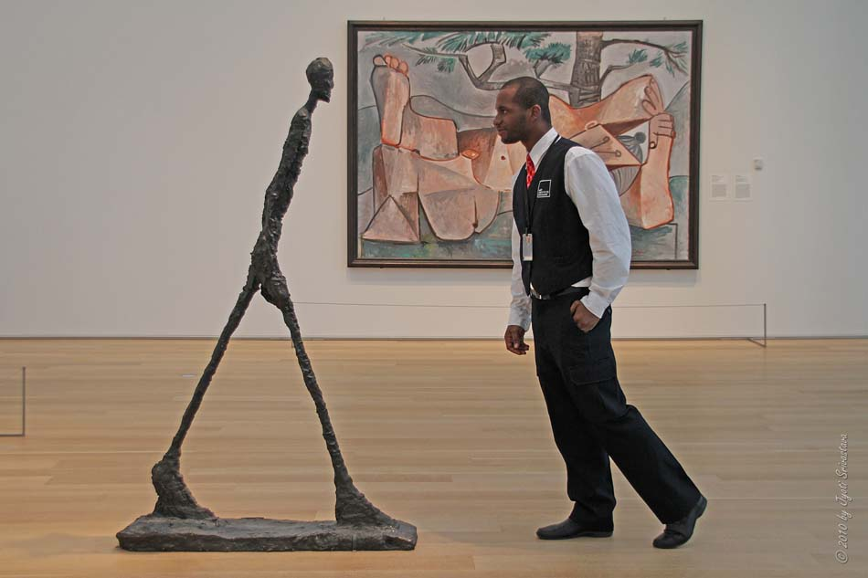

# A View from the Gallery

In building a website for myself, I always wanted a webpage that resembled an art gallery. A digital white wall with rotating art in overly ornate frames. This felt like an easy way to introduce someone to the things I valued or found interesting, and isn't that the goal of a personal website!

But as I thought about the idea more, I realized galleries offer more than pure aesthetic display, but rather the opporutnity to take on someone else's perspective. Great art necessitates a different worldview, a different set of assumptions for what to value or prioritize. Regardless of form, you're briefly accepting their assumptions for the nature of the physical world. 

In doing so, you quickly pickup on the variety between our own assumptions and anothers. Individually, our preconceptions will win the day. The bus route will be on the corner of State & Lake, the chicken will be baked at 350,  This routine and static way of seeing can carry us through days and years consuming the world; taking in buildings, songs, and food as discrete, pre-packaged goods. Even if we are malleable with these assumptions, it'll pale to outside influence. 

In reality these are all individual assumptions. For some individual, a skyscraper was once just an idea, . This is all a long-winded way of saying, with art what's possible for someone else becomes possible for you. All the things you were told that were not only true but must be believed just aren't so, you can reach your own assumptions. 

